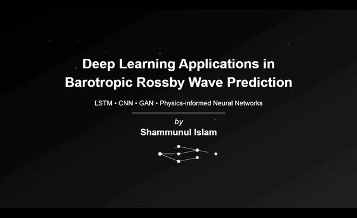

# Rossby Wave Deep Learning Prediction App



## Introduction
Welcome to the Rossby Wave Deep Learning Prediction App! This application simulates and predicts Rossby waves using various deep learning models, including LSTM, CNN, GAN, and Physics-Informed Neural Networks (PINNs). Built with Streamlit, it provides an interactive interface for generating wave simulations, training models, and visualizing predictions.

---

### Features

- **Simulate Rossby Waves:** Generate two-dimensional Rossby wave data using finite difference methods.
- **Model Selection:** Choose from LSTM, CNN, GAN, or PINN models to predict wave behavior.
- **Interactive Hyperparameters:** Adjust simulation and model hyperparameters in real-time.
- **Visualization:** View initial states, actual outcomes, and model predictions side by side.
- **Training Progress:** Monitor training progress and loss metrics live.

## Table of Contents
- **Background**
- **Getting Started**
  - **Prerequisites**
  - **Installation**
- **Usage**
  - **Simulation Parameters**
  - **Model Training**
  - **Wave Prediction**
- **Methods**
  - **Rossby Wave Equation**
  - **Deep Learning Models**
- 
- **Contributing**
- **License**
- **Acknowledgements**

## Background
The Rossby wave is a fundamental concept in geophysical fluid dynamics, describing large-scale motions in the Earth's atmosphere and oceans due to the planet's rotation. The two-dimensional barotropic Rossby wave equation is:

# Rossby Wave Equation Solver

This Streamlit app provides a numerical solution to the Rossby wave equation. The governing equation is:

$$
\frac{\partial}{\partial t} \nabla_H^2 \psi + \beta \frac{\partial \psi}{\partial x} = 0
$$

where

$$
\nabla_H^2 \psi = \partial_{xx} \psi + \partial_{yy} \psi
$$

represents the Laplacian in two dimensions.

We can use finite difference methods to solve the Rossby wave equation numerically. This process involves calculating spatial derivatives. The spatial derivatives are computed using second derivatives in both \( x \) and \( y \) directions:

$$
\frac{\partial^2 \psi}{\partial x^2} \approx \frac{\psi_{i+1,j} - 2 \psi_{i,j} + \psi_{i-1,j}}{\Delta x^2}
$$

$$
\frac{\partial^2 \psi}{\partial y^2} \approx \frac{\psi_{i,j+1} - 2 \psi_{i,j} + \psi_{i,j-1}}{\Delta y^2}
$$

## Boundary Conditions

We used both sinusoidal and Gaussian initial conditions in 2D:

- **Sinusoidal:**
  `ψ(x, y) = sin(4πx) sin(4πy)`

- **Gaussian:**
  `ψ(x, y) = exp(- ((x - x₀)² + (y - y₀)²) / (2σ²))`

## Getting Started

### Prerequisites
- Python 3.6+
- pip package installer

### Installation
1. Clone the repository:
   ```python
    git clone https://github.com/yourusername/rossby-wave-prediction-app.git
    cd rossby-wave-prediction-app
   ```
2. Create a Virtual Environment (Optional but Recommended)
   ```python
    python -m venv venv
    source venv/bin/activate   # On Windows: venv\Scripts\activate
   ```

3. Install Required Packages

    ```python
    pip install -r requirements.txt
    ```

4. Run the App

    ```python
    streamlit run rossby2_4.py
    ```

## Usage
### Simulation Parameters
1. Adjust Simulation Settings

  - Navigate to the sidebar.
  - Set parameters like grid points (Nx, Ny), domain lengths (Lx, Ly), Rossby parameter (β), wave numbers (kx, ky), Gaussian width (σ), total simulation time (T), and time step (dt).

2. Generate Rossby Wave

  - Click "Generate Rossby Wave".
  - View the initial wave state displayed in the main area.

### Model Training
1. Select Model Type

  - Choose from LSTM, CNN, GAN, or PINNs in the sidebar.
2. Set Model Hyperparameters

  - Depending on the model, adjust hyperparameters like sequence length, units, filters, kernel size, latent dimensions, iterations, batch size, and learning rate.
3. Run the Model

  - Click "Run the model".
  - Monitor the training progress, loss curves, and model summary displayed.

### Wave Prediction
1. Run Prediction

- After training, click "Run Prediction".
- Compare the Initial Wave State, Actual Wave State, and Predicted Wave State side by side.
- Review the mean squared error between the predicted and actual wave.

## Methods

### Deep Learning Models
1. **Long Short-Term Memory (LSTM)**
- Purpose: Capture temporal dependencies in sequential data.
- Architecture: Sequential model with LSTM layers followed by dense layers.
- Usage: Predict the next state of the wave given a sequence of previous states.

2. **Convolutional Neural Network (CNN)**
- Purpose: Capture spatial patterns in data.
- Architecture: Sequential model with convolutional layers.
- Usage: Predict the next spatial state based on the current state.

3. **Generative Adversarial Network (GAN)**
- Purpose: Generate new data samples mimicking the training data distribution.
- Architecture: Consists of a generator and discriminator network.
- Usage: Generate new wave states resembling actual wave states.

4. **Physics-Informed Neural Networks (PINNs)**
- Purpose: Incorporate physical laws into the neural network training process.
- Usage: Solve partial differential equations (PDEs) using neural networks.

## Contributing
Contributions are welcome! Please follow these steps:

1. **Fork the Repository**

Click on the "Fork" button at the top right of the repository page.

2. **Clone Your Fork**

```python
git clone https://github.com/yourusername/rossby-wave-prediction-app.git
cd rossby-wave-prediction-app
```

3. **Create a New Branch**

```python
git checkout -b feature/YourFeature
```

4. **Commit Your Changes**

```python
git commit -am 'Add new feature'
```

5. **Push to the Branch**

```python
git push origin feature/YourFeature
```